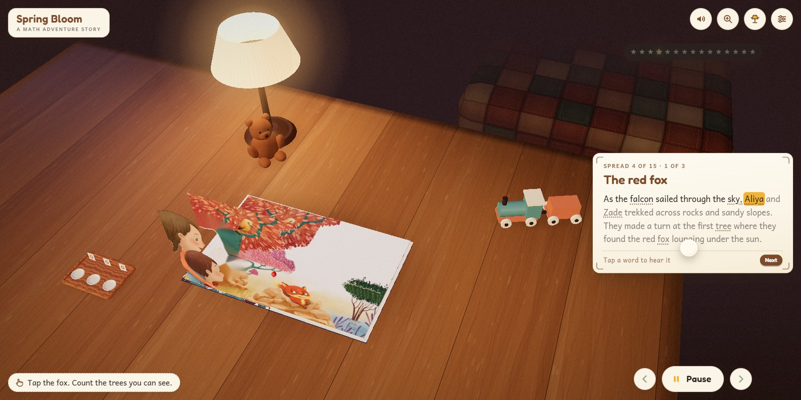

# Spring Bloom

[](https://spring-bloom-phi.vercel.app)

**[View it live →](https://spring-bloom-phi.vercel.app)**

*Spring Bloom* is a children's picture book about a family picnic in the mangroves,
written by Sadia Mir and Summer Al-Jarrah Bateiha, illustrated by Inna Ogando and
published by Hamad Bin Khalifa University Press in 2019. This is that book as a 3D
pop-up you can read in a browser.

The hardback lies on an oak desk under a lamp, with a plush bear, a wooden train and a
counting tray for company. Tap it and the cover swings open. Each page turn bends like
paper and can be dragged. When a spread settles, its illustration rises off the page as
layered paper cut-outs, the story text lifts onto a floating card, and a narrator reads
it with each word lit as it is spoken. Tap a word and it is said on its own. Tap the fox
and the camera flies to the fox.

Built with the authors' permission. Their credit is on the title page, under "About this
book" in the settings, and on the reel's end card.

## What is in it

- The whole book, in order: the cover, the title page, the 15 story spreads and the
  activities page.
- Page turns that curl, lift and sweep across the gutter. They can be dragged on desktop
  or touch, and are committed or thrown back by release speed.
- Pop-up layers cut from the printed illustrations: a back wall hinged at the far edge,
  characters standing up in a stagger, foreground plants last. Every cut-out breathes,
  and each spread has one living moment on top: an apple drops from the tree and rolls,
  the young falcon takes off, a crab scuttles, a bat crosses the cave mouth.
- Hover labels on the cut-outs, and speech bubbles: a quoted line leaves the story card
  and pops out of the character who says it.
- Read to me: one narrator reads spread to spread, and the page turns itself at the end
  of each.
- A counting tray beside the book, with a dish each for pebbles, twigs and shells and a
  paper digit tile behind every dish. As the children count trees, crabs and flowers the
  tray counts with them, ten shells gathering into a twig and ten twigs into a pebble, so
  the book's place-value lesson happens on the desk.
- A portrait composition for phones, with its own camera ledger and card placement.
- Reduced motion drops the sparkle cursor, the camera drift and the pop-up stagger, and
  settles page turns without animation.

## How it works

**Paper cut-outs from the real art.** `tools/layers.py` reads a mask recipe per spread
(`tools/masks/NN.json`), segments each named layer with SAM2 from a box and a few point
prompts, keys the paper white to alpha, despills the edges so no cut-out carries a pale
halo, and writes the cut-outs plus a plate of the page with the standing layers removed
and their holes filled. Every pixel of illustration on screen comes from the printed book.

**A pose ledger drives the camera.** `js/ledger.js` holds a row for every pose the camera
can rest at, per spread and per kind: the closed book, the title, home, the story card,
and one row per cut-out computed from its box, foot and tilt. Flights are logged as
transitions, so the pose at any second can be recomputed from the log, and a portrait
ledger re-fits every row for a phone.

**One clock for live and capture.** `js/clock.js` owns the only time value. Live mode
advances it from `requestAnimationFrame`; capture mode sets it from outside. Everything
animated is a function of that time plus the book's event log, with seeded noise from
`js/rng.js`, so a seek to any second lands on the right frame and the reel renders from
the same code the reader runs.

**Word-by-word read-along.** The narration was generated once with ElevenLabs'
`with-timestamps` endpoint (`scripts/gen-audio.mjs`). The per-word start and end times
live in `assets/timings/` and drive the highlight, the tap-to-hear-a-word slices, the
speech bubbles and the counting beats.

**No bundler.** three.js and the post-processing library are vendored and loaded through
a native import map. `index.html`, `js/`, `css/`, `assets/` and `vendor/` are the whole
site; everything else in this repository is the pipeline that made it.

## Layout

| Path | What it is |
|---|---|
| `index.html` | The shell: import map, canvas, the DOM layers for the card, labels and interface |
| `js/app.js` | The spine: boots the scene, wires every module, owns the seek |
| `js/book.js` `js/leaf.js` `js/turn.js` | The hardback, the bending sheet, the drag and the turn |
| `js/ledger.js` `js/camera.js` | The authored camera |
| `js/popup.js` `js/life.js` `js/labels.js` | Cut-outs standing up, their living moments, the label pills |
| `js/narration.js` `js/card.js` `js/karaoke.js` `js/bubbles.js` | The story card, the read-along, the speech bubbles |
| `js/tray.js` `js/count-events.js` | The counting tray |
| `js/scene.js` `js/props.js` | The desk, the lamp, the toys, the room |
| `js/tour.js` `js/capture.js` | The scripted tour and the capture overlays the reel uses |
| `assets/` | Spreads, cut-outs, narration, timings, sound, textures |
| `tools/` | The Python pipeline: page extraction, the cover, the layers, probe pages, the dev server |
| `scripts/` | ElevenLabs generation for the narration, the labels, the effects and the music bed |
| `reel/` | The HyperFrames composition for the vertical reel, and its tour |
| `CONTRACTS.md` | The module contracts the build was split by |

## Running it

```bash
python tools/serve.py        # http://127.0.0.1:8326
```

Any static server works. This one sends `no-store` on everything, because without it
Chrome keeps ES modules in its disk cache and an edited module silently keeps running
its old code.

| Flag | Effect |
|---|---|
| `?capture&t=<seconds>` | Render one frame at a fixed time and hold it |
| `?tour=1` | Play the reel's scripted tour (`reel/tour.json`); with `capture`, a seek replays it frame by frame |
| `?w=1080&h=1920&dpr=1` | Pin the frame size, so a render never depends on the browser window |
| `?seed=<n>` | The noise seed for the grain, the sparkles and the breathing |
| `?reduced=1` | Force reduced motion |

## Credits and licence

*Spring Bloom* is written by **Sadia Mir** and **Summer Al-Jarrah Bateiha**, illustrated by
**Inna Ogando**, and published by **Hamad Bin Khalifa University Press** (2019). The text and
the illustrations, including every cut-out and plate under `assets/`, belong to the authors,
the illustrator and the publisher. They are included here with their permission for this
project only and may not be reused from this repository.

The narration is a synthetic voice generated with ElevenLabs. The cut-outs were segmented
with SAM2 through fal. three.js (MIT) and postprocessing (Zlib) are vendored under their
own licences in `vendor/`.

The code is MIT. See [`LICENSE`](LICENSE).
